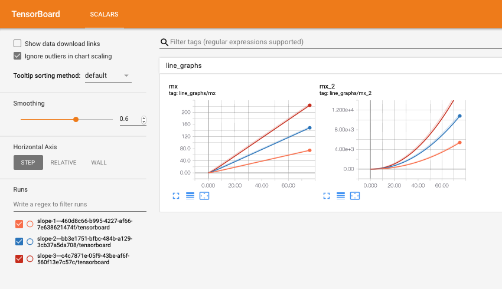

# Cox: An experimental design and analysis framework
You can find API Documentation on Cox [here](https://cox.readthedocs.io), along with a copy of the
Walkthrough below.

## Introduction
Cox is a lightweight, serverless framework for designing and managing
experiments. Inspired by our own struggles with ad-hoc filesystem-based
experiment collection, Cox aims
to be a minimal burden while inducing more organization. Created by [Logan
Engstrom](https://twitter.com/logan_engstrom) and [Andrew
Ilyas](https://twitter.com/andrew_ilyas). 

Cox works by helping you easily __log__, __collect__, and
__analyze__ experimental results. For API documentation, see [here](https://cox.readthedocs.io); below, we
provide a walkthrough that illustrates the most important features of Cox.

__Why "Cox"? (Aside)__: The name Cox draws both from
[Coxswain](https://en.wikipedia.org/wiki/Coxswain), the person in charge of
steering the boat in a rowing crew, and from the name of [Gertrude
Cox](https://en.wikipedia.org/wiki/Gertrude_Mary_Cox), a pioneer of experimental
design.

#### Installation
Cox can by installed via PyPI as:
```bash
pip3 install cox
```

Cox requires Python 3 and has been tested with Python 3.7.

#### Citation
```
@unpublished{cox,
    title={Cox: A Lightweight Experimental Design Library},
    author={Logan Engstrom and Andrew Ilyas},
    year={2019},
    url={https://github.com/MadryLab/cox}
}
```

#### Illustrative example
```python
import os
from cox.store import Store
import shutil
import subprocess
from cox.readers import CollectionReader

"""
Background: suppose we have two functions f(x, param) and g(x, param) that we
want to track as x ranges from 0 to 100, over a set of values for param. We also
want to visualize f(x) with TensorBoard
"""
OUT_DIR = ...
POSSIBLE_PARAM_VALUES = [...]

def f(x, param):
    ...

def g(x, param):
    ...

for param in POSSIBLE_PARAM_VALUES:
    # Creates a cox.Store, which stores a set of tables and a tensorboard
    store = Store(OUT_DIR)
    # Create a table to store hyperparameters in for each run
    store.add_table('metadata', {'param': float})
    # The metadata table will just have a single row with the param stored
    store['metadata'].append_row({'param': param})
    
    # Create a table to store our results
    store.add_table('results', {'f(x)': float, 'g(x)': float})

    for x in range(100):
	# Log f(x) to the results table and to tensorboard
	store.log_table_and_tb('results', {
	    'f(x)': f(x, param), 
	})
	# Log g(x) to the table but not to TensorBoard. The working row has not
	# changed, so f(x) above and g(x) will be in the same row
	store['results'].update_row({ 'g(x)': g(x, param) })

	# Close the working row
	store['results'].flush_row()

    store.close()

    # Comparing results programmatically with CollectionReader
    reader = CollectionReader(OUT_DIR)
    df = reader.df('results')
    m_df = reader.df('metadata')

    # Filter by experiments have "param" less than 1.0
    exp_ids = set(m_df[m_df['param'] < 1.0]['exp_id].tolist())
    print(df[df['exp_id'].isin(exp_ids)]) # The filtered DataFrame

    # Finding which experiment has lowest minimum f(x)
    exp_id = df[df['results'] == min(df['results'].tolist())]['exp_id'].tolist()[0]
    print(m_df[m_df['exp_id'] == exp_id]) # Metadata of the best experiment

    # Start tensorboard to compare across parameters who match the regex REGEX
    os.system("python -m cox.tensorboard_view --logdir OUT_DIR --format-str p-{param} \ 
	    --filter-param param REGEX --metadata-table metadata"])

```

## Quick Logging Overview 
The cox logging system is designed for dealing with repeated experiments. The
user defines schemas for [Pandas
dataframes](https://pandas.pydata.org/pandas-docs/stable/reference/api/pandas.DataFrame.html)
that contain all the data necessary for each experiment instance. Each
experiment ran corresponds to a __data store__, and each specified dataframe
from above corresponds to a table within this store. The experiment stores are
organized within the same directory. Cox has a number of utilities for running
and collecting data from experiments of this nature.

## Interactive Introduction

We use Cox most in our machine learning work, but Cox is agnostic to the type or
style of code that you write. To illustrate this, we go through an extremely
simple example in a walkthrough.

## Walkthrough 1: Logging in Cox
__Note 1__: you can view all of the components of this running example in the [example file here](examples/logging_example.py)!

__Note 2__: a copy of this walkthrough is also available together with our API
documentation, [here](https://cox.readthedocs.io/en/latest/)

In this walkthrough, we'll be starting with the following simple piece of code,
which tries to finds the minimum of a quadratic function:

```python
import sys

def f(x):
    return (x - 2.03)**2 + 3

x = ...
tol = ...
step = ...

for _ in range(1000):
    # Take a uniform step in the direction of decrease
    if f(x + step) < f(x - step):
        x += step
    else:
        x -= step

    # If the difference between the directions
    # is less than the tolerance, stop
    if f(x + step) - f(x - step) < tol:
        break
```
### Initializing stores
Logging in Cox is done through the `Store` class, which can be created as follows:
```python
from cox.store import Store
# rest of program here...
store = Store(OUT_DIR)
```

Upon construction, the `Store` instance creates a directory with a random `uuid`
generated name in ```OUT_DIR```, a `HDFStore` for storing data, some logging
files, and a tensorboard directory (named `tensorboard`). Therefore, after we run this command, our `OUT_DIR` directory should look something like this:

```bash
$ ls OUT_DIR
7753a944-568d-4cc2-9bb2-9019cc0b3f49
$ ls 7753a944-568d-4cc2-9bb2-9019cc0b3f49
save        store.h5    tensorboard
```

The experiment ID string `7753a944-568d-4cc2-9bb2-9019cc0b3f49` was
autogenerated. If we wanted to name the experiment something else, we could pass
it as the second parameter; i.e. making a store with `Store(OUT_DIR, 'exp1')`
would make the corresponding experiment ID `exp1`.


### Creating tables
The next step is to declare the data we want to store via _tables_. We can add
arbitrary tables according to our needs, but we need to specify the structure
ahead of time by passing the schema. In our case, we will start out with just a
simple metadata table containing the parameters used to run an instance of the
program above, along with a table for writing the result:

```python
store.add_table('metadata', {
  'step_size': float,
  'tolerance': float, 
  'initial_x': float,
  'out_dir': str
})

store.add_table('result', {
    'final_x': float,
    'final_opt':float
})

```

Each table corresponds exactly to a [Pandas dataframe](https://pandas.pydata.org/pandas-docs/version/0.23.4/generated/pandas.DataFrame.html) found in an `HDFStore`
object.

#### Note on serialization
Cox supports basic object types (like `float`, `int`, `str`, etc) along with any
kind of serializable object (via `dill` or using PyTorch's serialization
method). In particular, if we want to serialize an object we can pass one of the
following types: `cox.store.[OBJECT|PICKLE|PYTORCH_STATE]` as the type value
that is mapped to in the schema dictionary. `cox.store.PYTORCH_STATE` is
particularly useful for dealing with PyTorch objects like weights.
In detail: `OBJECT` corresponds to storing the object as a
serialized string in the table, `PICKLE` corresponds to storing the object as a
serialized string on disk in a separate file, and `PYTORCH_STATE` corresponds to
storing the object as a serialized string on disk using `torch.save`. 

### Logging
Now that we have a table, we can write rows to it! Logging in Cox is done in a
row-by-row manner: at any time, there is a _working row_ that can be appended
to/updated; the row can then be flushed (i.e. written to the file), which starts
a new (empty) working row. The relevant commands are:

```python
# This updates the working row, but does not write it permenantly yet!
store['result'].update_row({
  "final_x": 3.0
})

# This updates it again
store['result'].update_row({
  "final_opt": 3.9409
})

# Write the row permenantly, and start a new working row!
store['result'].flush_row()

# A shortcut for appending a row directly
store['metadata'].append_row({
  'step_size': 0.01,
  'tolerance': 1e-6, 
  'initial_x': 1.0,
  'out_dir': '/tmp/'
}) 
```

#### Incremental updates with `update_row`
Subsequent calls to update_row will edit the same working row. 
This is useful if different parts of the row are computed in different 
functions/locations in the code, as it removes the need for passing statistics 
around all over the place.

### Reading data
By populating tables rows, we are really just adding rows to an underlying
`HDFStore` table. If we want to read the store later, we can simply open another
store at the same location, and then read dataframes with simple commands:

```python
# Note that EXP_ID is the directory the store wrote to in OUT_DIR
s = Store(OUT_DIR, EXP_ID)

# Read tables we wrote earlier
metadata = s['metadata'].df
result = s['result'].df

print(result)
```

Inspecting the `result` table, we see the expected result in our Pandas dataframe!
```
     final_x   final_opt
0   3.000000   3.940900
```

### `CollectionReader`: Reading many experiments at once
Now, in our quadratic example, we aren't just going to try one set of
parameters, we are going to try a number of different values for `step_size`,
`tolerance`, and `initial_x`, as we have not yet discovered convex optimization.
To do this, we just run the script above a bunch of times with the desired
hyperparameters,  supplying the _same_ `OUT_DIR` for all of the runs (recall
that `cox` will automatically create different, `uuid`-named folders inside
`OUT_DIR` for each experiment).

Imagine that we have done so (using any standard tool, e.g. `sbatch` in SLURM,
`sklearn` grid search, etc.), and that we have a directory full of stores (this
is why we use `uuid`s instead of handpicked names!):

```bash
$ ls $OUT_DIR
drwxr-xr-x  6 engstrom  0424807a-c9c0-4974-b881-f927fc5ae7c3
...
...
drwxr-xr-x  6 engstrom  e3646fcf-569b-46fc-aba5-1e9734fedbcf
drwxr-xr-x  6 engstrom  f23d6da4-e3f9-48af-aa49-82f5c017e14f
```

Now, we want to collect all the results from this directory. We can use
`cox.readers.CollectionReader` to read all the tables together in a concatenated
`pandas` table.

```python
from cox.readers import CollectionReader
reader = CollectionReader(OUT_DIR)
print(reader.df('result'))
```

Which gives us all the `result` tables concatenated together as a 
[Pandas DataFrame](https://pandas.pydata.org/pandas-docs/stable/reference/api/pandas.DataFrame.html) for easy manipulation:

```
     final_x   final_opt                                exp_id
0   1.000000    4.060900  ed892c4f-069f-4a6d-9775-be8fdfce4713
0   0.000010    7.120859  44ea3334-d2b4-47fe-830c-2d13dc0e7aaa
...
...
0   2.000000    3.000900  f031fc42-8788-4876-8c96-2c1237ceb63d
0 -14.000000  259.960900  73181d27-2928-48ec-9ac6-744837616c4b
```

`pandas` has a ton of powerful utilities for searching through and
manipulating DataFrames. We recommend looking at [their
docs](https://pandas.pydata.org/pandas-docs/stable/reference/api/) for
information on how to do this. For convenience, we've given a few simple
examples below:

```python
df = reader.df('result')
m_df = reader.df('metadata')

# Filter by experiments have step_size less than 1.0
exp_ids = set(m_df[m_df['step_size'] < 1.0]['exp_id].tolist())
print(df[df['exp_id'].isin(exp_ids)]) # The filtered DataFrame

# Finding which experiment has the lowest final_opt
exp_id = df[df['final_opt'] == min(df['final_opt'].tolist())]['exp_id'].tolist()[0]
print(m_df[m_df['exp_id'] == exp_id]) # Metadata of the best experiment
```

## Walkthrough 2: Using `cox` with `tensorboardX`
__Note__: As with the first walkthrough, a working example file with all of
these commands can be found [here](examples/tb_example.py)

Here, we'll show how to use `cox` and `tensorboardX` in unison for logging.
We'll use the following simple running example:
```python
from cox.store import Store

for slope in range(5):
    s = Store(OUT_DIR) # Create OUT_DIR/RANDOM_UUID
    s.add_table('line_graphs', {'mx': int, 'mx^2': int})
    s.add_table('metadata', {'slope': int})
    s['metadata'].append_row({'slope': slope})

    # GOAL: plot and log the lines "y=slope*x" and "y=slope*x^2"
```

As previously mentioned, `cox.Store` objects also automatically creates a
`tensorboard` folder that is written to via the
[tensorboardX](https://tensorboardx.readthedocs.io/en/latest/tensorboard.html)
library. A created `cox.store.Store` object will actually a `writer` property
that is a fully functioning
[SummaryWriter](https://tensorboardx.readthedocs.io/en/latest/tensorboard.html#tensorboardX.SummaryWriter)
object. That means we can plot the lines we want in TensorBoard as follows:

```python
for x in range(10):
    s.writer.add_scalar('line', slope*x, x)
    s.writer.add_scalar('parabola', slope*(x**2), x)
```

Unfortunately, TensorBoard data is quite hard to read/manipulate through means
other than the TensorBoard interface. For convenience, the `store` object also
provides the ability to write to a table and the `tensorboardX` writer at the same
time through the `log_table_and_tb` function, meaning that we can replace the
above with:

```python
# Does the same thing as the example above but also stores the results in a
# readable 'line_graphs' table 
for x in range(10):
    s.log_table_and_tb('line_graphs', {'mx': slope*x, 'mx^2': slope*(x**2)})
    s['line_graphs'].flush_row()
```

### Viewing multiple tensorboards with `cox.tensorboard_view`
**Note: the `python -m cox.tensorboard_view` command can be called as
`cox-tensorboard` from the command line**

Continuing with our running example, we may now want to visually compare
TensorBoards across multiple parameter settings. Fortunately, `cox`
provides utilities for comparing TensorBoards across experiments in a readable
way.  In our example, where we made a `Store` object and a table
called `metadata` where we stored hyperparameters. We also showed how to
integrate TensorBoard logging via `tensorboardX`. We'll now use the
`cox.tensorboard-view` utility to view the tensorboards from multiple jobs at
once (this is useful when comparing parameters for a grid search).

The way to achieve this is through the `cox.tensorboard_view` command, which is
called as `python3 -m cox.tensorboard_view` with the following arguments:

- `--logdir`: **(required)**, the directory where all of the stores are located
- `--port`: **(default 6006)**, the port on which to run the tensorboard server
- `--metadata-table` **(default "metadata")**, the name of the table where the
  hyperparameters are saved (i.e. "metadata" in our running example). This
should be a table with a single row, as in our running example.
- `--filter-param` **(optional)** Can be used more than once, filters out stores
  from the tensorboard aggregation. For each argument of the form
`--filter-param PARAM_NAME PARAM_REGEX`, only the stores where `PARAM_NAME` in
the metadata matches `PARAM_REGEX` will be kept.
- `--format-str` **(required)** How to display the name of the stores. Recall
  that each store has a `uuid`-generated name by default. This argument
determines how their names will be displayed in the TensorBoard. Curly braces
represent parameter values, and the uuid will always be appended to the name. So
in our running example, `--format-str ss-{step_size}` will result in a
TensorBoard with names of the form `ss-1.0-ed892c4f-069f-4a6d-9775-be8fdfce4713`.

So in our running example, if we run the following command, displaying the slope
in the TensorBoard names and filtering for slopes between 1 and 3:
```bash
python3 -m cox.tensorboard_view --logdir OUT_DIR --format-str slope-{slope} \
    --filter-param slope [1-3] --metadata-table metadata
```
or 
```bash
cox-tensorboard --logdir OUT_DIR --format-str slope-{slope} \
    --filter-param slope [1-3] --metadata-table metadata
```
then navigating to `localhost:6006` yields:


